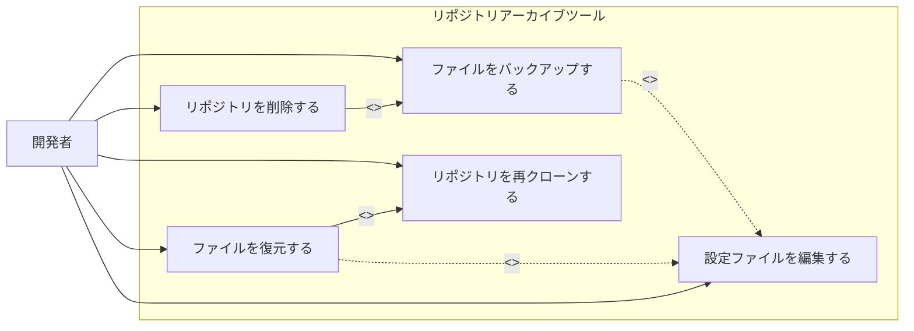

# リポジトリアーカイブツール 要求定義・要件定義

## 概要

本ツールは、安定期に入り更新頻度の低くなったGitリポジトリをローカル環境から削除する際に、特定の設定ファイル（例：.env）やデータベースファイル（例：SQLiteの.db/.sqlite3）などをバックアップ（退避）し、再度プロジェクトを再開するときに簡単に復元できるように支援するツールである。

## 背景・課題

- ローカル環境に多数のGitリポジトリが存在する。
- プロジェクトが安定期に入り更新が滅多にないリポジトリはローカルから削除したい。
- 環境変数ファイルやDBファイルなどは再現が困難なため残したい。
- 再開する場合には簡単に元の状態に戻せることが求められる。

## ツール概要

本ツールは以下の作業を簡略化・自動化する。

- Gitリポジトリ内の指定されたファイルをバックアップする。
- リポジトリをローカルから完全削除する。
- 再開時にリポジトリを再クローンし、バックアップファイルを復元する。

## 機能要件

### 1. バックアップ機能

- 指定の設定ファイルやデータベースファイルを任意のバックアップディレクトリにコピーできる。
- バックアップの履歴管理用に、日付・プロジェクト名・バックアップ対象ファイル情報を含むメタデータファイル（YAMLまたはJSON）を作成し、バックアップファイルとともに管理する。

#### バックアップファイルの管理

- バックアップファイルのファイル名
単純にファイル名にプロジェクト名や日付を入れてもよいですが、管理が複雑になる可能性があるため、簡潔な名前が推奨されます（例：project-a_latest.tar.gz）。
- 別途メタデータファイルを作成する
バックアップ時に、詳細な情報（日付、プロジェクト名、対象ファイル、サイズなど）を記録したメタデータファイル（例：YAMLまたはJSON）を作成します。

##### ファイル構成例

```plaintext
~/.archive-tool/backups/project-a/
├── backups.yaml              # メタデータファイル
├── backup_20250320_153045.tar.gz
├── backup_20250315_101200.tar.gz
└── backup_latest.tar.gz
```

```yaml:backups.yaml
project: project-a
backups:
  - filename: backup_20250320_153045.tar.gz
    timestamp: 2025-03-20T15:30:45+09:00
    files:
      - .env
      - db.sqlite3
  - filename: backup_20250315_101200.tar.gz
    timestamp: 2025-03-15T10:12:00+09:00
    files:
      - .env
```

### 2. リポジトリ削除機能

- バックアップが完了したことを確認後、リポジトリを安全に削除する。
- 誤操作を防止するため、削除前に確認メッセージを表示する。

### 3. 復元機能

- バックアップ情報（設定ファイル）に記録されたGitリポジトリのURL、ブランチ名を使って再クローンを自動で行える。
- バックアップしておいたファイルを元の場所に復元できる。

### 4. 設定ファイル管理

- YAML形式の設定ファイルで管理対象リポジトリ情報を記録する。
- YAMLファイルのスキーマ定義・バリデーションにはJSON Schemaを使用する。
- 設定ファイルには以下の情報を記録できること。
  - プロジェクト名
  - GitリポジトリのURL
  - ブランチ名
  - バックアップ対象ファイルのパス

### 5. クロスプラットフォーム

- macOSおよびLinux環境で単一のバイナリとして動作する。

## 非機能要件

- Go言語で実装し、単一のバイナリファイルとして配布可能であること。
- 追加の依存関係がなく、手軽に利用可能であること。
- 操作はコマンドラインインターフェース（CLI）で行えること。
- コマンドの使用方法が明確に表示されること。

## ユースケース



- ファイルをバックアップする
  - 指定されたファイルをバックアップする。
  - 設定ファイルを編集する によって対象ファイルが変更・追加可能（extend関係）。
- リポジトリを削除する
  - バックアップ処理が必須で、必ず ファイルをバックアップする が含まれる（include関係）。
- リポジトリを再クローンする
  - 設定ファイルに記載された情報を元に再クローンを行う。
- ファイルを復元する
  - 再クローン後、バックアップ済みファイルを復元する。
  - 設定ファイルを編集する で対象を変更可能（extend関係）。
  - 必ず リポジトリを再クローンする が含まれる（include関係）。
- 設定ファイルを編集する
  - YAML設定ファイルを手動で編集し、対象リポジトリやファイルを管理する。

### バックアップして削除する場合

1. バックアップ対象のリポジトリに移動。
2. バックアップコマンドを実行（例：`archive-tool backup`）。
3. 削除コマンドを実行（例：`archive-tool delete`）。

### プロジェクト再開の場合

1. ツールにプロジェクト名を指定して復元コマンドを実行（例：`archive-tool restore project-a`）。
2. リポジトリが再クローンされ、バックアップファイルが元の場所に復元される。

## 制約・前提条件

- Gitがインストール済みであること。
- YAML設定ファイルにバックアップ・復元対象ファイルが正しく記載されていること。
- YAMLファイルのバリデーションにJSON Schemaを使用するため、外部ライブラリを使用すること。
